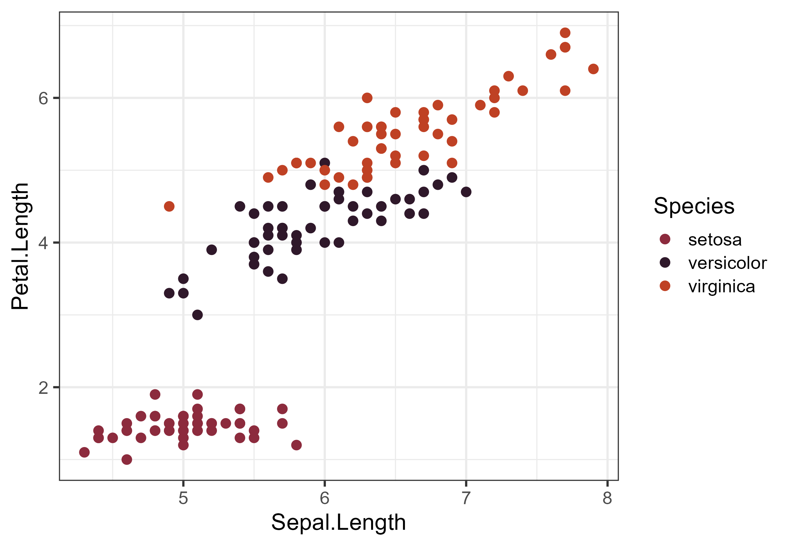

# **ButterflyColors** 

<!-- badges: start -->

[](https://github.com/junqueiragaabi/ButterflyColors/blob/master/LICENSE.md)
[](https://twitter.com/junqueiragaabi)

<!-- badges: end -->

## Overview

The ButterflyColors package contains color palette for plotting in R based on butterfly species.
For species with sexual dimorphisms, we used male colors.

## Installation

You can install the development version of ButterflyColors from [GitHub](https://github.com/) with:

``` r
# install.packages("devtools")
devtools::install_github("junqueiragaabi/ButterflyColors")
library(ButterflyColors)
```
## The color scales

Butterfly palettes were extected from photographs using Adobe Color. We defined the five dominant colors in each butterfly species.
All photographs used were taken by Sofia Schirmer from biological collections of Brazilian universities.


## Usage

The color palettes per species are organized in a list called butterfly_species:

``` r
library(ButterflyColors)
names(butterfly_species)
```
    ## [1] "philaethria_dido"                 "anteos_menippe"                   "fountainea_ryphea"
    ## [4] "lycorea_hallia"                   "morpho_helenor"                  "archaeoprepona_demophon_thalpius"
    ## [7] "brassolis_sophorae"               "historis_acheronta"               "stalachtis_phlegia_susanna"
    ## [10] "battus_polydamas"                 "anteos_clorinde"                  "chorinea_licursis"
    ## [13] "danaus_eresimus"                  "smyrna_blomfidiana"               "astraptes_fulgerator"
    ## [16] "hamadryas_feronia"                "pseudolycaena_marsyas"            "catagramma_pygas"
    ## [19] "heliconius_sara_apseudes"         "synargis_calyce"                  "hamadryas_feronia"
    ## [22] "heliconius_erato_phyllis"         "hylephila_phyleus"                "danaus_erippus"
    ## [25] "danaus_gilippus"                  "junonia_evarete"                  "hemiargus_hanno"
    ## [28] "dynamine_postverta"               "parides_zacynthus_polymetus"      "marpesia_petreus"

and the function `butterfly_palettes` returns a vector with the color palette (hex color codes) of a butterfly.

``` r
butterfly_palettes(specie = "morpho_helenor")
```
    ## [1] "#4590BF" "#79BED9" "#6CCED9" "#A65C41" "#0D0D0D"

A few examples...

```r
library(tidyverse)

ggplot(iris, aes(x = Sepal.Length, y = Petal.Length, colour = Species)) +
  geom_point(size = 3) +
  scale_colour_manual(values = butterfly_palettes("fountainea_ryphea"))
```




## Contribute

Can't find the species you want?

If you would like to contribute to this package, please contact [Gabriela Junqueira](https://twitter.com/junqueiragaabi)
or [Sofia Schirmer](https://twitter.com/xixirmer) on Twitter or submit a pull request

## Credits

The structure of this package was inspired by the [`feathers`](https://github.com/shandiya/feathers) and [`fishualize`](https://github.com/nschiett/fishualize) packages.